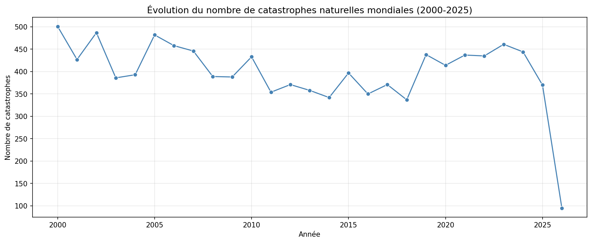
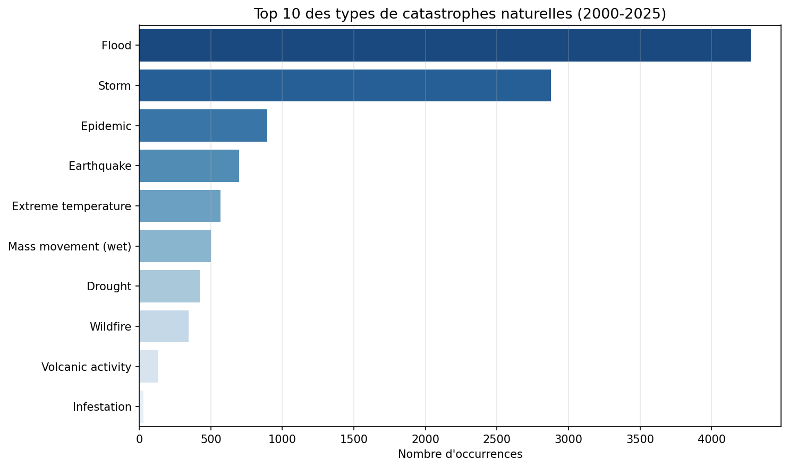
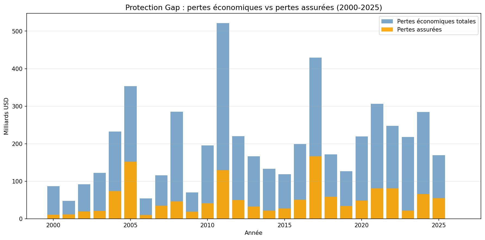
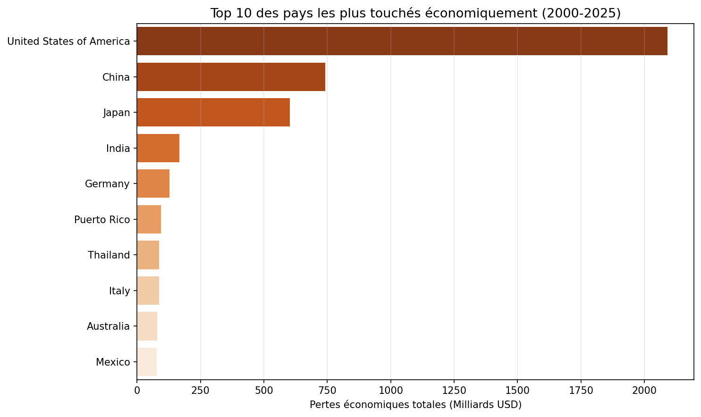

# Natural Catastrophes Analysis — Global Data 2000-2025

## Overview
This project analyzes public EM-DAT data to explore the evolution of natural 
catastrophes over 25 years, with a focus on the **protection gap** the difference 
between total economic losses and insured losses.

This concept is central to the reinsurance industry, where understanding and 
closing this gap is one of the key strategic challenges for players like 
Swiss Re, Munich Re or AXA XL.

## Key Questions
- How has the frequency of natural catastrophes evolved since 2000?
- Which types of events are the most frequent and the most costly?
- How large is the protection gap at a global scale?
- Which countries are the most economically exposed?

## Visualizations

### 1. Evolution of Natural Catastrophes

### 2. Top 10 Disaster Types

### 3. Protection Gap

### 4. Most Affected Countries

## Key Findings
- **Frequency is stable** between 350 and 500 events per year, with no clear upward trend
- **Floods and storms dominate** accounting for the majority of recorded events
- **The protection gap is massive** insured losses represent only a fraction of total economic losses
- **2011 and 2017 were exceptional years** Japan tsunami, Thailand floods, and hurricanes Harvey/Irma/Maria
- **The US leads economic exposure** over $2,000 billion in cumulative losses since 2000

## Limitations

While EM-DAT is the most comprehensive public database on natural catastrophes, 
several limitations should be kept in mind when interpreting this analysis.

### 1. Missing Data
A significant share of economic and insured loss values are missing, 
particularly for developing countries. These countries tend to report 
casualties more reliably than financial damages. As a result, the protection 
gap calculated in this analysis is likely **underestimated**, the true gap 
is probably wider than what the data suggests.

### 2. Reporting Bias
Not all countries report catastrophes with the same level of detail. 
Events in Europe or North America are typically well-documented, 
while similar events in Sub-Saharan Africa or Southeast Asia may be 
absent or incomplete. This introduces a **geographic bias** that skews 
the analysis toward wealthier, better-documented regions.

### 3. Insured Loss Reporting
Insured loss figures largely rely on declarations from insurers themselves, 
which can be incomplete, delayed, or revised over time. Final insured loss 
estimates for recent events may therefore still evolve after the data extraction date.

### 4. Catastrophe Definition Thresholds
EM-DAT only records events that meet minimum criteria: at least 10 deaths, 
100 people affected, a declaration of state of emergency, or a call for 
international assistance. Small but recurrent events that collectively 
generate significant losses may therefore be **invisible** in this dataset.

### 5. Inflation and Asset Value Changes
Even when using inflation-adjusted figures, comparing losses across 25 years 
remains complex. The value of exposed assets (real estate, infrastructure, 
equipment) has increased significantly over the period, meaning that the same 
physical event would generate much higher losses today than in 2000,
independently of any change in hazard frequency or intensity.

### 6. Scope of Analysis
This project focuses on frequency and economic exposure. It does not cover 
mortality analysis, regional deep-dives, or predictive modeling,
all of which would require additional data sources and methodologies.

## Data Source
[EM-DAT — The International Disaster Database](https://www.emdat.be)  
CRED, Université catholique de Louvain, Brussels, Belgium

## Tools & Technologies
- Python 3
- Pandas
- Matplotlib
- Seaborn
- Google Colab

## Author
Personal project — June 2026  
*Exploring NatCat risk and reinsurance concepts through data analysis*
